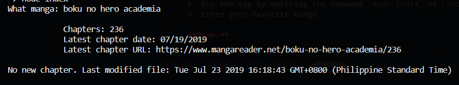

# Manga Update Checker (Mauch)
Are you tired of going to your favorite manga sites like Mangareader just to check whether your favorite manga has a new chapter or not?

Manga Update Checker or Mauch might solve this.

Mauch is a NodeJS app that shows you the latest chapter and date of your favorite manga without opening your web browser.

Just simply type in the manga you want to check and it will show you the information you need. 

A `txt` file, containing the data of the manga you searched, will be created. It is used to compare the data retrieved from the website *(mangareader.com)* and the data from the `txt` file to check if the manga has a new chapter.

Must have Node JS installed in your machine.

How to install?
1. Clone this repo
2. Open your terminal then go to the directory of the cloned repo
3. Install the packages by entering the command `npm i` or `npm install`
4. Run the app by entering the command `node index` or `node index.js`
5. Enter your favorite manga

**Demo:**

Creates a file if searched for the first time

Checks if there's a new chapter

